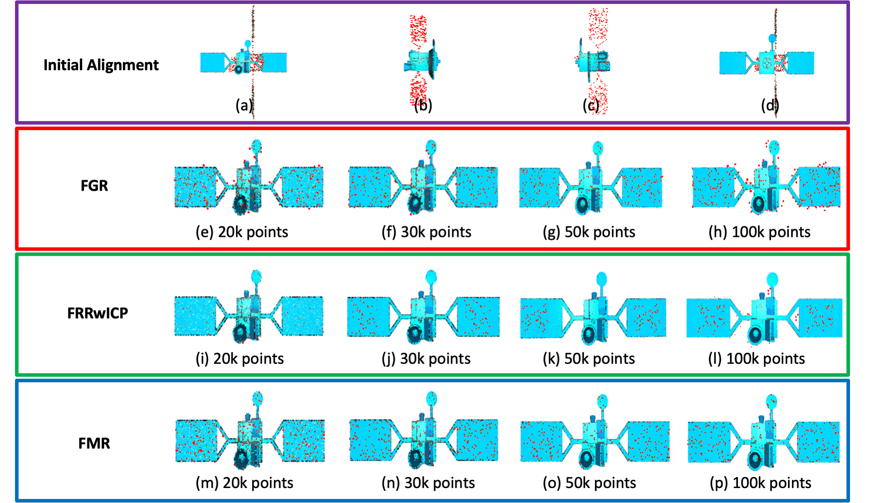

# Time-of-Flight Cameras in Space: Pose Estimation with Deep Learning Methodologies
This research, based on the master thesis of the author, is focused on the development of a NN-based approach for Object Detection and 6 DoF Pose Estimation with ToF Cameras for space applications. The aim is that of designing a NN-based approach able to detect a part of a satellite (such as a gripping interface) and estimate its 6 DoF pose to support on-orbit servicing missions.  
Please note that the project is based on `Python v3.8.12`, `TensorFlow v2.6.0` and `PyTorch v1.9.1`, and it is built upon `MacOS BigSur v11.3.1`.

`main.py` is the starting script: it retrieves the camera interface available for recordings and it begins the data acquisition.   

***

## Data Acquisition
In order to make this code works, after having downloaded the software from the official site, the right `.zip` folder has to be extracted and placed into this one, so that `_roypy.so` image can be found by the scripts.

`utils` folder contains the scripts for acquiring data in real-time, using both Open3D for point cloud drawings and OpenCV for depth maps and amplitude images visualization.   

### OpenCV
`camera_imagedata.py` script captures image data, filling OpenCV images and displaying data with HighGUI.  
OpenCV can be downloaded [here](https://opencv.org/releases/).

### Open3D
`camera_3d.py` script captures depth maps and visualizes 3D Point Clouds dinamically changing.  
Please find more details about the library [here](http://www.open3d.org/docs/release/).

### OpenCV and Open3D
`camera_imagedata_3d.py` script captures both depth and amplitude data, starting different threads to simultaneously show images through OpenCV library and 3D point clouds through Open3D.

***

## MPI and Shot Denoising
`mpi_denoising` folder contains the code for denoising the data acquired through the camera. In particular, shot and MPI denoising are performed.
Two state-of-the-art networks are implemented, namely `Coarse-Fine CNN` and `SHARPNet`.

### Coarse-Fine CNN
`coarse_fine_cnn` folder contains a model that is a hybrid implementation of the network (and the data augmentation strategy) described in [this paper](https://lttm.dei.unipd.it/paper_data/MPI_CNN/CNN_for_MPI-eccvw18.pdf) and the one available at [this paper](https://openaccess.thecvf.com/content_CVPR_2019/supplemental/Agresti_Unsupervised_Domain_Adaptation_CVPR_2019_supplemental.pdf), and it is built thanks to the useful insights provided by the author of the papers, Gianluca Agresti.  
Please read the paper(s) for more information.

### SHARPNet
`sharp_net` folder contains the implementation of the model described in [this paper](https://www.ecva.net/papers/eccv_2020/papers_ECCV/papers/123690035.pdf). Since we are interested in a single modulation frequency method, this is the approach that is finally used in this work.
Please find more details about the algorithm in the linked paper. 

***

## Point-Cloud Registration
`pcd_registration` folder contains the code for the point-cloud registration between a 3D satellite model target and the source acquired one. Three state-of-the-art models are currently taken into account to perform this final task, namely `Fast Global Registration (FGR)`, `FPFH + RANSAC Registration (FRR)`, and `Feature-Metric Registration (FMR)`.

### FGR
`fast_global_registration.py` implements the fast global registration approach, that is described [here](http://vladlen.info/papers/fast-global-registration.pdf). It achieves state-of-the-art results for what concerns Optimization-Based methods. 

### FRR (FPFH + RANSAC Registration)
`global_registration.py` approach uses FTFH features extraction as described [here](https://www.cvl.iis.u-tokyo.ac.jp/class2016/2016w/papers/6.3DdataProcessing/Rusu_FPFH_ICRA2009.pdf), followed by the classical RANSAC method presented in [this paper](http://www.cs.ait.ac.th/~mdailey/cvreadings/Fischler-RANSAC.pdf). This model has been chosen to be the representative of Feature-Learning methods, due to its simplicity and yet its effectiveness.

### FMR
`fmr` folder contains the code for the implementation of the algorithm described [here](https://arxiv.org/pdf/2005.01014.pdf). The strength of this method relies on its robustness to noise, outliers and density difference (in contrast with "geometric" methods as the ones previously introduced), its fastness and it high accuracy.  
Please find more information about the model in the relative paper.

***

## Results

### Denoising Approaches
To reduce the complexity of the proposed SHARP-Net, two variants are proposed, ToF-KPN (based on a U-Net model built upon an autoencoder with skip connections) and a reduced version of SHARP-Net without the last two blocks.   
The following images show the results of the denoising approaches: ToF-KPN always obtains the worst outcomes, while the two variants of SHARP-Net get very similar ones.

By considering the execution times, ToF-KPN is always the fastest, being the simplest model. The original SHARP-Net is the slowest, while its smaller variant achieves very good results in almost half the time required by SHARP-Net.  
Thus, its low complexity, its online performance and the optimal results make it a perfect candidate for this work.

### PCD Registration Approaches
Several starting poses for the source and different sizes for the target are considered to evaluate the performance and the robustness of the registration approaches. Feature-Metric Registration clearly outperforms all the others regardless of the starting position of the source point cloud and the dimensionality of the target one. 

FMR always gets the best results while still being incredibly fast: it only takes less than 0.4 seconds to converge with relatively small point clouds (as the ones obtained by the camera used in this work).  
Its optimal results, coupled with the low complexity and the online performance, definitely prove the choice that has been made about this algorithm.
